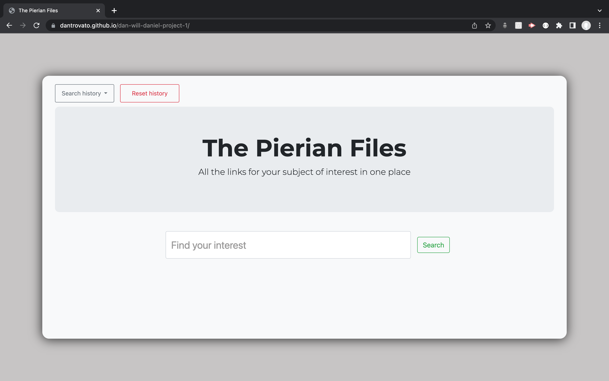
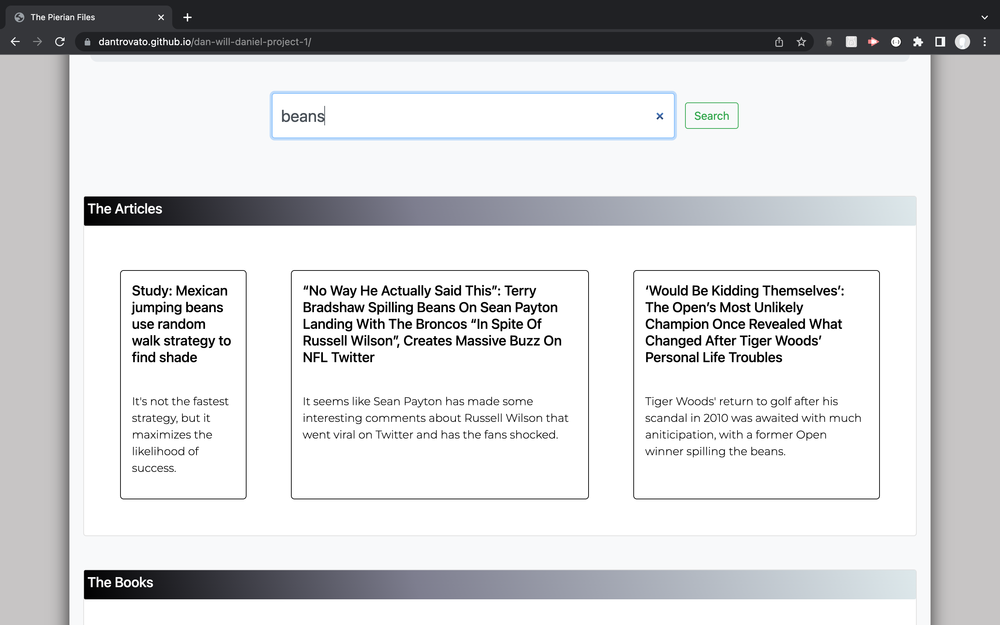
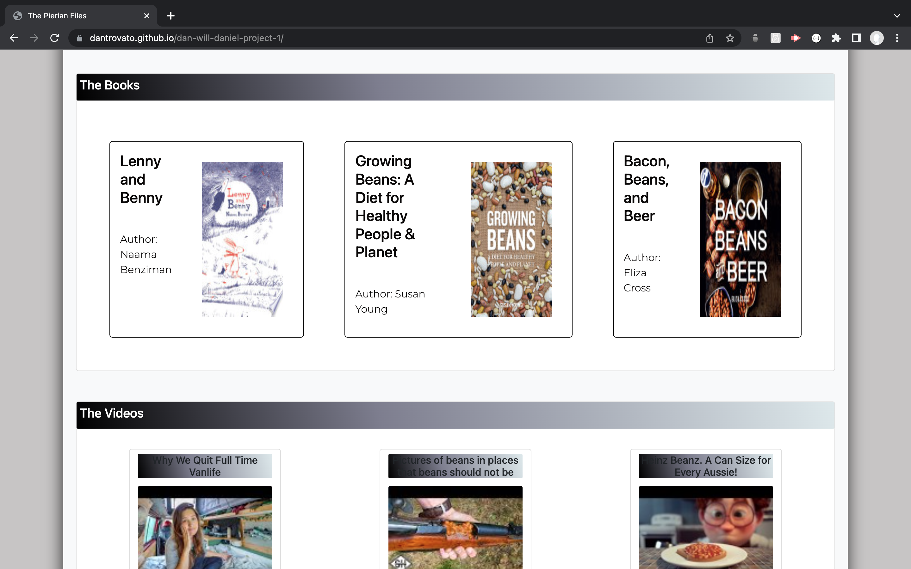
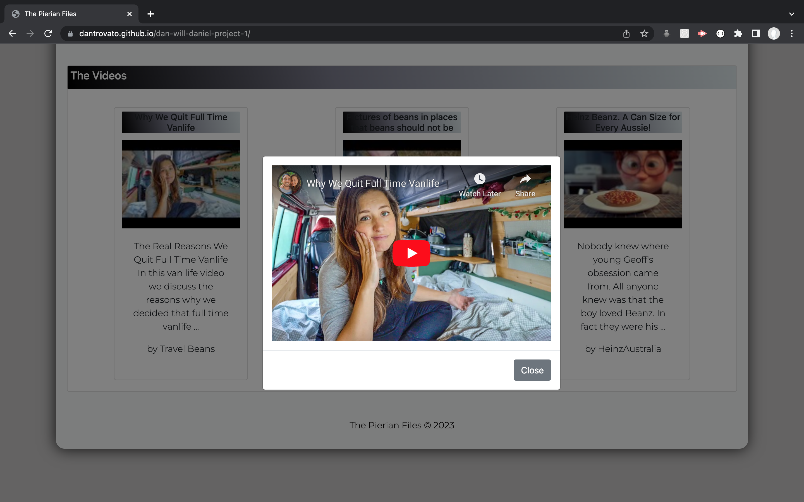

# The Pierian Files

A single page application where a handful of articles, books and videos on a related topic are presented to a user after they searched for it

## Libraries and other technologies used

Bootstrap 4.6, Googlefonts, JQuery, Javascript, CSS, HTML

## Installation

- Clone the repository:
  git clone git@github.com:dantrovato/dan-will-daniel-project-1.git

## The deployed application

https://dantrovato.github.io/dan-will-daniel-project-1/

## The GitHub repsitory

https://github.com/dantrovato/dan-will-daniel-project-1

## Usefull features

Follow the links below to learn more about the functionalities of this project:
[][1]
[][2]
[][3]
[][4]
[1]: https://www.w3schools.com/html
[2]: https://www.w3schools.com/css
[3]: https://getbootstrap.com
[4]: https://www.w3schools.com/js

## User story

As a user, I want to be able to input a search item in a search input and be shown a selection of articles, books and videos on a related topic.
I also want to have a way to keep track of my searched items and a way to clear my search history.

## Acceptance criteria

- It is done when I can be shown articles, books and videos on a topic of my choosing.
- It is done when I can click on a Search History button to view my previously searched items.
- It is done when I can click on a button to clear my search history.
- It is done when the project uses Bootstrap.
- It is done when the project is deployed to GitHub Pages.
- It is done when the project is responsive to fit a mobile phone or a tablet.
- It is done when the project uses modals instead of alerts, confirms, or prompts.
- It is done when the project uses client-side storage to store persistent data.
- It is done when the project has a polished UI

## Future features

- Add another section where a handful of podcasts are returned by the search
- Make the search history items clickable and when they are make a new fetch request for that item

## Screenshots

The landing page

The articles section

The books section

The videos section

